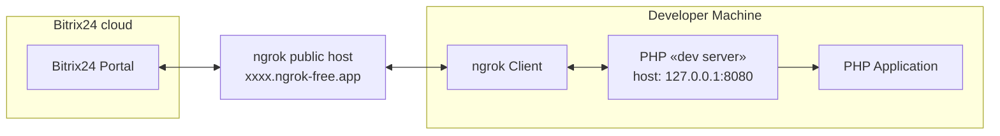

## Local application with token storage
Local application example for education purposes.

1. Application **must** store admin token and work with this token.
2. Application **must** provide cli-command for run from shell.
3. Application **must** store applicaton-specific data in local file

### Architecture

### Installation cases

#### Local application without UI


#### Local application with UI

### File structure
```
\bin
    console.php - CLI script
\config
    .env - example env file
    .env.local - non commited file with actual data
    .auth.json.local - auth data from application
\src
    Application.php - example of local application
\var
    \log
        application-YYYY-m-d.log – application log
event-handler.php – event handler           
index.php - base script loaded in default application placement
install.php - script for installation steps processing 
```

