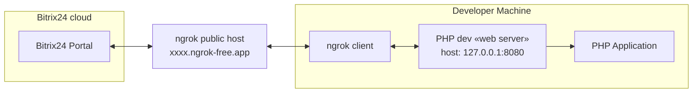
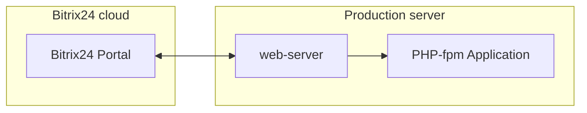

## Local application with placement

Local application example for education purposes.

1. Application **must** store admin token and work with this token.
2. Application **must** provide cli-command for run from shell.
3. Application **must** store application-specific data in local file

### Example folder file structure

```
/bin
    console.php - CLI script
/config
    .env - example env file
    .env.local - non commited file with actual data
    .auth.json.local - auth data from application
/public - folder served with web-server
    event-handler.php – event handler           
    index.php - base script loaded in default application placement
    install.php - script for installation steps processing
/src
    Application.php - example of local application         
/var
    /log
        application-YYYY-m-d.log – application log
.gitignore - file with list of files and folders ignored with VCS
composer.json - configuration file used by Composer, a dependency management tool for PHP. This file defines the dependencies required for a project and specifies various metadata about the project.
composer.lock - automatically generated by Composer. It ensures that the same versions of dependencies are used every time the project is installed, providing consistency across different environments.
Makefile - commands for static code analysis of the codebase.
phpstan.neon.dist – phpstan config
rector.php - rector config        
```


### Architecture

#### Developer configuration for local development on his machine



#### Production configuration


### Installation local application with UI
1. Get actual version of SDK
2. Open shell and go to folder `/examples/local-app-with-token-storage/`
3. Install dependencies via composer

```shell
composer install
```

4. Go to folder `public` and
   start [built-in PHP web-server](https://www.php.net/manual/en/features.commandline.webserver.php).

> [!WARNING]  
> This web server is designed to aid application development. It may also be useful for testing purposes or for
> application demonstrations that are run in controlled environments. It is not intended to be a full-featured web server.

```shell
php -S 127.0.0.1:8080
```

5. In other tab check is server running and see output

```shell
curl -v 127.0.0.1:8080
```

6. Open other tab and see application log, log files created with current date.

```shell
ls var/log/ 
tail -f var/log/application-2024-09-15.log
```

7. Expose your local PHP dev web-server to internet via [ngrok](https://ngrok.com/)

```shell
ngrok http 127.0.0.1:8080
```

You will see output from ngrok local client

```
Session Status                online
Account                       Maksim (Plan: Free)
Update                        update available (version 3.16.0, Ctrl-U to update)
Version                       3.10.0
Region                        United States (us)
Latency                       196ms
Web Interface                 http://127.0.0.1:4040
Forwarding                    https://a3b4-94-143-197-46.ngrok-free.app -> http://127.0.0.1:8080
```

8. Check is your tunnel running and you expose application to global internet

```shell
curl -v https://a3b4-94-143-197-46.ngrok-free.app
```

9. Open ngrok local web interface [http://127.0.0.1:4040/](http://127.0.0.1:4040/) and see last request
10. Go to Bitrix24 portal → left menu → «Developer resources» → «Other» → «Local application»
11. Select «server» type of application
12. In «handler path» enter **your** forwarding address `https://c421-94-143-197-46.ngrok-free.app/index.php` with **index.php**
13. In «Initial installation path» enter **your** forwarding address `https://c421-94-143-197-46.ngrok-free.app/install.php` with
    **install.php**
14. Fill «Menu item text» with value «Example App»
15. Assign permissions and add scopes: `crm`, `user_brief`,`placement`
16. Click on «Save» button and see buttons «Open Applicatoin» and «Reinstall».
17. Now you can see new inputs `Application ID (client_id)` and `Application key (client_secret)` with secret keys for your application. 
18. Go to folder `config` and make a copy of file `.env`

```shell
cp .env .env.local
```

19. Open file `.env.local` and copy secret data from Bitrix24 local application settings:
    - `Application ID (client_id)` to `BITRIX24_PHP_SDK_APPLICATION_CLIENT_ID`
    - `Application key (client_secret)` to `BITRIX24_PHP_SDK_APPLICATION_CLIENT_SECRET`
    - `Assign permissions` (scope) to `BITRIX24_PHP_SDK_APPLICATION_SCOPE`

You get file like this example:

```
BITRIX24_PHP_SDK_APPLICATION_CLIENT_ID='YOUR_DATA_HERE'
BITRIX24_PHP_SDK_APPLICATION_CLIENT_SECRET='YOUR_DATA_HERE'
BITRIX24_PHP_SDK_APPLICATION_SCOPE='crm,user_brief,placement'
```
20. Now we have finish configure app, good job!
21. Click on button «Reinstall» and you see installation flow in logs.
21. Open new tab in console and go to folder `bin/`
20. Run command

```shell
php -f console.php
```

You see console output

```
Try to connect to bitrix24 with local application credentials and call method «server.time»...
server time: 2024-09-15 22-53-26
```
