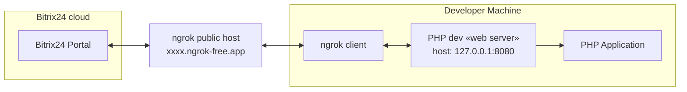

## Local application with token storage

Local application example for education purposes.

1. Application **must** store admin token and work with this token.
2. Application **must** provide cli-command for run from shell.
3. Application **must** store application-specific data in local file

### Architecture



### Installation cases

#### Run local application without UI

1. Get actual version of SDK
2. Open shell and go to folder `/examples/local-app-with-token-storage/`
3. Install dependencies via composer

```shell
composer install
```

4. Start built-in PHP wev-server

```shell
php -S 127.0.0.1:8080
```

5. In other tab check is server running and see output

```shell
curl -v 127.0.0.1:8080
```

6. Open other tab and see application log, log files created with current date

```shell
tail -f var/log/application-2024-09-15.log
```
7. Expose your local PHP dev web-server to internet via [ngrok](https://ngrok.com/)
```shell
ngrok http 127.0.0.1:8080
```
You will see output from ngrok local client
```
Session Status                online
Account                       Maksim (Plan: Free)
Update                        update available (version 3.16.0, Ctrl-U to update)
Version                       3.10.0
Region                        United States (us)
Latency                       196ms
Web Interface                 http://127.0.0.1:4040
Forwarding                    https://c421-94-143-197-46.ngrok-free.app -> http://127.0.0.1:8080
```
8. Check is your tunnel running and you expose application to global internet
```shell
curl -v https://c421-94-143-197-46.ngrok-free.app
```
9. Open ngrok local web interface [http://127.0.0.1:4040/](http://127.0.0.1:4040/) and see last request
10. Go to left menu → «Developer resources» → «Other» → «Local application» 
11. Select «server» type of application
12. In «handler path» enter forwarding address `https://c421-94-143-197-46.ngrok-free.app/index.php` with **index.php**
13. In «Initial installation path» enter forwarding address `https://c421-94-143-197-46.ngrok-free.app/install.php` with 
14. Set checkbox «Script only (no user interface)» ← ⚠️ it`s important
15. Assign permissions and add scopes: `crm`, `user_brief`
16. Click on «Save» button and see button «reinstall». 
17. You can see:
    - POST request on endpoint `https://c421-94-143-197-46.ngrok-free.app/install.php` on ngrok web interface [http://127.0.0.1:4040/](http://127.0.0.1:4040/)
    - detailed data in application log in folder `var/log/application-*.log`
    - stored admin auth token in file `config/auth.json.local` 
18. Go to folder `config` and make a copy of file `.env`
```shell
cp .env .env.local
```
19. Open file `.env.local` and copy secret data from Bitrix24 local application settings:
    - `Application ID (client_id)` to `BITRIX24_PHP_SDK_APPLICATION_CLIENT_ID`
    - `Application key (client_secret)` to `BITRIX24_PHP_SDK_APPLICATION_CLIENT_SECRET`
    - `Assign permissions` (scope) to ``
You get file like this example:
```
BITRIX24_PHP_SDK_APPLICATION_CLIENT_ID='YOUR_DATA_HERE'
BITRIX24_PHP_SDK_APPLICATION_CLIENT_SECRET='YOUR_DATA_HERE'
BITRIX24_PHP_SDK_APPLICATION_SCOPE='crm,user_brief'
```
20. Now we have stored application data and admin token. Now we can create requests to Bitrix24 REST-API.
21. Open new tab in console and go to folder `bin/`
20. Run command
```shell
php -f console.php
```
You see console output
```
Try to connect to bitrix24 with local application credentials and call method «server.time»...
server time: 2024-09-15 22-53-26
```


#### Local application with UI

### File structure

```
\bin
    console.php - CLI script
\config
    .env - example env file
    .env.local - non commited file with actual data
    .auth.json.local - auth data from application
\src
    Application.php - example of local application
\var
    \log
        application-YYYY-m-d.log – application log
event-handler.php – event handler           
index.php - base script loaded in default application placement
install.php - script for installation steps processing 
```

