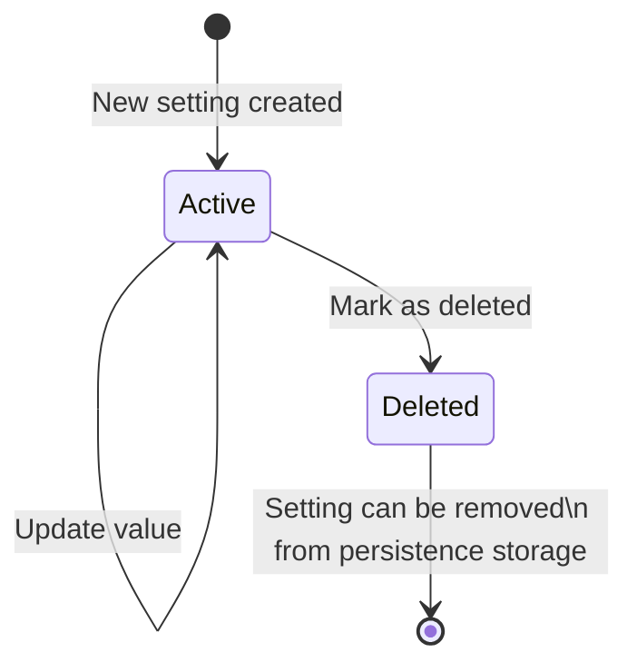
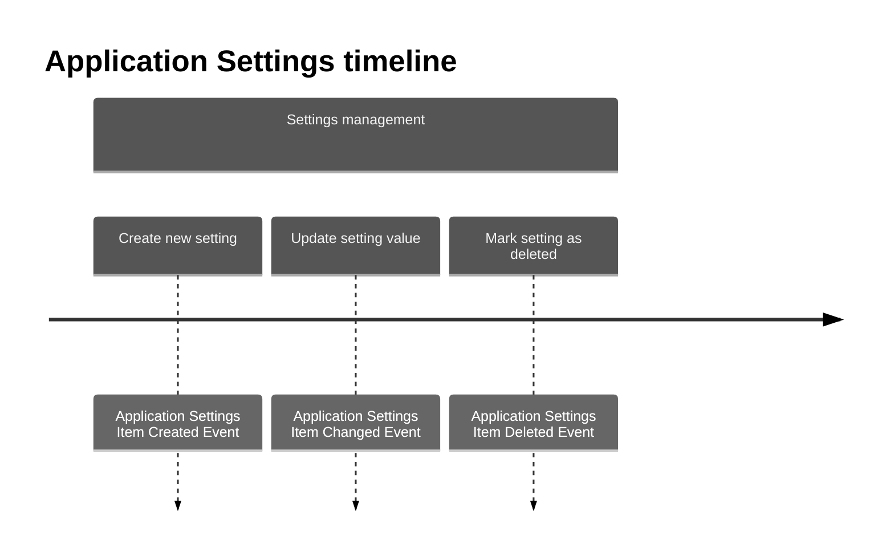

# Application Settings entity

Store application configuration settings with support for different scopes: global settings for entire application installation, user-specific settings, and department-specific settings.

| Method                            | Return Type                   | Description                                                              | Throws                     |
|-----------------------------------|-------------------------------|--------------------------------------------------------------------------|----------------------------|
| `getId()`                         | `Uuid`                        | Returns unique setting id                                                | -                          |
| `getApplicationInstallationId()`  | `Uuid`                        | Returns application installation id related to this setting              | -                          |
| `getKey()`                        | `string`                      | Returns setting key (name)                                               | -                          |
| `getValue()`                      | `string`                      | Returns setting value                                                    | -                          |
| `getBitrix24UserId()`             | `?int`                        | Returns Bitrix24 user id for user-specific setting (null for global)    | -                          |
| `getBitrix24DepartmentId()`       | `?int`                        | Returns Bitrix24 department id for department setting (null otherwise)  | -                          |
| `getChangedByBitrix24UserId()`    | `?int`                        | Returns Bitrix24 user id who last changed this setting                   | -                          |
| `isRequired()`                    | `bool`                        | Checks if this setting is required for application                       | -                          |
| `isActive()`                      | `bool`                        | Checks if setting is active (not deleted)                                | -                          |
| `getStatus()`                     | `ApplicationSettingStatus`    | Returns setting status (active or deleted)                               | -                          |
| `getCreatedAt()`                  | `CarbonImmutable`             | Returns date and time setting was created                                | -                          |
| `getUpdatedAt()`                  | `CarbonImmutable`             | Returns date and time setting was last updated                           | -                          |
| `updateValue()`                   | `void`                        | Updates setting value and tracks who changed it                          | -                          |
| `markAsDeleted()`                 | `void`                        | Marks setting as deleted (soft delete)                                   | -                          |
| `isGlobal()`                      | `bool`                        | Checks if setting is global (not user or department specific)            | -                          |
| `isPersonal()`                    | `bool`                        | Checks if setting is user-specific                                       | -                          |
| `isDepartmental()`                | `bool`                        | Checks if setting is department-specific                                 | -                          |

## Application Settings scope types

Application settings support three scope types:

- **Global settings**: Apply to entire application installation (both `bitrix24UserId` and `bitrix24DepartmentId` are null)
- **Personal settings**: User-specific settings (`bitrix24UserId` is set, `bitrix24DepartmentId` is null)
- **Departmental settings**: Department-specific settings (`bitrix24DepartmentId` is set, `bitrix24UserId` is null)

## Application Settings state diagram

## Repository methods

- `public function save(ApplicationSettingsItemInterface $applicationSettingsItem): void;`
    - use case CreateSetting
    - use case UpdateSetting
    - use case DeleteSetting
- `public function delete(Uuid $uuid): void;`
    - use case DeleteSetting
- `public function findById(Uuid $uuid): ?ApplicationSettingsItemInterface;`
    - use case GetSetting
    - use case UpdateSetting
- `public function getById(Uuid $uuid): ApplicationSettingsItemInterface;`
    - use case GetSetting
    - use case UpdateSetting
    - use case DeleteSetting
- `public function findAllForInstallation(Uuid $uuid): array;`
    - use case GetAllSettings
    - use case ExportSettings
- `public function findAllForInstallationByKey(Uuid $uuid, string $key): array;`
    - use case GetSettingsByKey
    - use case ResolveSettingValue (with scope priority: personal > departmental > global)

## Events

- `ApplicationSettingsItemCreatedEvent` — event is triggered when a new application setting is created. Contains setting id and timestamp.
- `ApplicationSettingsItemChangedEvent` — event is triggered when a setting value is updated. Contains setting id, key, old value, new value, who changed it, and timestamp.
- `ApplicationSettingsItemDeletedEvent` — event is triggered when a setting is marked as deleted (soft delete). Contains setting id and timestamp.
